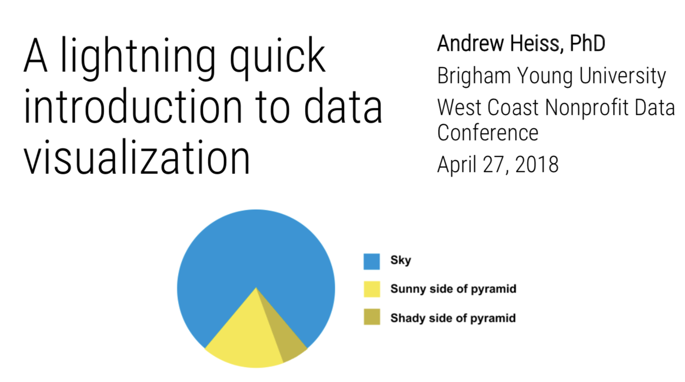

# A Lightning Quick Introduction to Data Visualization

[Andrew Heiss](https://www.andrewheiss.com/) • Romney Institute of Public Management • Brigham Young University  
Workshop given at the [2018 West Coast Nonprofit Data Conference](https://westcoastnonprofitdata.org/)  
April 27, 2018

---

This repository contains:

- [An HTML page](https://talks.andrewheiss.com/wcnpd18/) full of helpful links and resources for data visualzation
- [The PowerPoint file of the presentation I did](presentation/wcnpd18.pptx) (because I still haven't gotten around to using [xaringan](https://github.com/yihui/xaringan))
- [A PDF of the presentation](presentation/andrew-heiss_dataviz_wcnpd18.pdf)

---

