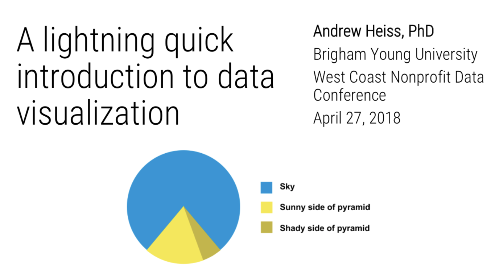

```{r setup, warning=FALSE, message=FALSE, include=FALSE}
library(tidyverse)
library(pander)
library(scales)
```


# Slides

[Download the slides from today's workshop](presentation/andrew-heiss_dataviz_wcnpd18.pdf)

[](presentation/andrew-heiss_dataviz_wcnpd18.pdf)


# Data to play with

## Converging stacked bar chart: PISA attitudes toward reading

Source: North American (Canada, Mexico, and the United States) results from the 2009 Programme of International Student Assessment (PISA), [provided by the OECD](https://www.oecd.org/pisa/).

```{r pisa, echo=FALSE, results="asis"}
data_frame(Question = c("For me, reading is a waste of time",
                        "I only read if I have to",
                        "Reading is one of my favorite hobbies",
                        "I feel happy if I receive a book as a present"),
           `Strongly disagree` = c(.422, .228, .203, .193),
           Disagree = c(.406, .359, .363, .277),
           `Agree` = c(.11, .305, .319, .402),
           `Strongly agree` = c(.061, .107, .114, .129)) %>% 
  mutate_at(vars(-Question), funs(percent)) %>% 
  pandoc.table(split.tables = Inf, justify = "lcccc")
```


## Dot plot: Kindergarten readiness intervention

Source: Data invented by [Stephanie Evergreen](http://stephanieevergreen.com/easy-dot-plots-in-excel/)

```{r kindergarten, echo=FALSE, results="asis"}
tribble(~Subject,         ~Fall, ~Spring,
        "Literacy",       34,    69,
        "Language",       63,    77,
        "Mathematics",    67,    75,
        "Science",        92,    98,
        "Creative arts",  96,    100) %>% 
  pandoc.table(justify = "lcc")
```

## Slopegraph or dot plot: Bank profits head east

Source: [The Economist, July 3, 2012](https://www.economist.com/blogs/graphicdetail/2012/07/daily-chart-0)

```{r taxes, echo=FALSE, results="asis"}
tribble(~Region,                       ~`2007`, ~`2011`,
        "Asia Pacific",                .189,    .539,
        "North America",               .265,    .234,
        "Middle East and Africa",      .042,    .065,
        "Latin America",               .025,    .065,
        "Western Europe",              .462,    .063,
        "Central and Eastern Europe",  .018,    .034) %>% 
  mutate_at(vars(-Region), funs(percent)) %>% 
  pandoc.table(split.tables = Inf, justify = "lcc")
```


# Resources

## Books

- Alberto Cairo, *The Truthful Art: Data, Charts, and Maps for Communication* (Berkeley, California: New Riders, 2016).
- Stephanie D. H. Evergreen, *Effective Data Visualization: The Right Chart for the Right Data* (Thousand Oaks, CA: Sage, 2017).
- Dona M. Wong, *The Wall Street Journal Guide to Information Graphics: The Dos and Don’ts of Presenting Data, Facts, and Figures* (London: W. W. Norton & Company, 2010).
- Hadley Wickham and Garrett Grolemund, *R for Data Science: Import, Tidy, Transform, Visualize, and Model Data* (Sebastopol, California: O’Reilly Media, 2017). [[FREE online](http://r4ds.had.co.nz/)]
- Alberto Cairo, *The Functional Art: An Introduction to Information Graphics and Visualization* (Berkeley, California: New Riders, 2013).
- Robin Williams, *The Non-Designer’s Design & Type Books: Design and Typographic Principles for the Visual Novice, Deluxe Edition.* (Berkeley, California: Peachpit Press, 2008).


## Interesting and excellent real world examples

- [The Stories Behind a Line](http://www.storiesbehindaline.com/)
- [Australia as 100 people](https://flowingdata.com/2017/06/28/australia-as-100-people/)
- [Marrying Later, Staying Single Longer](https://flowingdata.com/2017/07/17/marrying-age-over-the-past-century/)


## How to select the appropriate chart type

Many people have created many useful tools for selecting the correct chart type for a given dataset or question. Here are some of the best:

- [**The Data Visualisation Catalogue**](http://www.datavizcatalogue.com/): Descriptions, explanations, examples, and tools for creating 60 different types of visualizations.
- [**The Data Viz Project**](http://datavizproject.com/): Descriptions and examples for 150 different types of visualizations. Also allows you to search by data shape and chart function (comparison, correlation, distribution, geographical, part to whole, trend over time, etc.).
- [**The Chartmaker Directory**](http://chartmaker.visualisingdata.com/): xamples of how to create 51 different types of visualizations in 31 different software packages, including Excel, Tableau, and R.
- [**R Graph Catalog**](http://shinyapps.stat.ubc.ca/r-graph-catalog/): R code for 124 ggplot graphs.
- [**Emery's Essentials**](http://annkemery.com/essentials/): Descriptions and examples of 26 different chart types.


## Helpful data visualization resources {#resources}

- [**Storytelling with Data**](http://www.storytellingwithdata.com/): Blog and site full of resources by Cole Nussbaumer Knaflic.
- [**Ann K. Emery's blog**](http://annkemery.com/blog/): Blog and tutorials by [Ann Emery](https://twitter.com/AnnKEmery).
- [**Evergreen Data**](http://stephanieevergreen.com/): Helful resources by [Stephanie Evergreen](https://twitter.com/evergreendata).
- [**PolicyViz**](https://policyviz.com/): Regular podcast and site full of helpful resources by [Jon Schwabisch](https://twitter.com/jschwabish).
- [**\@HelpMeViz**](https://twitter.com/HelpMeViz): Community of people who give advice on how to visualize data.
- [**Visualising Data**](http://www.visualisingdata.com/): Fantastic collection of visualization resources, articles, and tutorials by [Andy Kirk](https://twitter.com/visualisingdata).
- [**Info We Trust**](http://infowetrust.com/): Detailed explorations of visualizations by [RJ Andrews](https://twitter.com/infowetrust), including a [beautiful visual history of the field](http://infowetrust.com/history/).
- [**FlowingData**](https://flowingdata.com/): Blog by [Nathan Yau](https://twitter.com/flowingdata).
- [**Information is Beautiful**](http://www.informationisbeautiful.net/): Blog by [David McCandless](https://twitter.com/mccandelish).
- [**Junk Charts**](http://junkcharts.typepad.com/): Blog by [Kaiser Fung](https://twitter.com/junkcharts).
- [**WTF Visualizations**](http://viz.wtf/): Visualizations that make you ask "What the F^rea^k?"^[ `r emo::ji("speak_no_evil")` Hi BYU! `r emo::ji("speak_no_evil")`]
- [**The Data Visualization Checklist**](http://annkemery.com/checklist/): A helpful set of criteria for grading the effectiveness of a graphic.
- [**Data Literacy Starter Kit**](https://docs.google.com/document/d/1kKRadOiF0LruItsvGA40fSDZkAQfCqC_Ela0gBdo8A4/edit): Compilation of resources to become data literate by [Laura Calloway](http://lauracalloway.com/).
- [**Seeing Data**](http://seeingdata.org/): A series of research projects about perceptions and visualizations.


## Visualization in Excel

- [**How to Build Data Visualizations in Excel**](http://stephanieevergreen.com/how-to/): Detailed tutorials for creating 14 different visualizations in Excel.
- [**Ann Emery's tutorials**](http://annkemery.com/category/visualizing-data/tutorials/): Fantastic series of tutorials for creating charts in Excel.


## Working with R and ggplot2

*Pro-tip*: Searching for help with R on Google can be tricky because the program is, um, a single letter. Try searching for "rstats" instead. If you use Twitter, post R-related questions and content with [#rstats](https://twitter.com/search?q=%23rstats). The R community on [StackOverflow](https://stackoverflow.com/) is also incredibly kind and helpful.

- [**Kieran Healy, *Data Visualization for Social Science: A practical introduction with R and ggplot2***](http://socviz.co/): This is a new, still-in-draft book that provides excellent examples and tutorials about how to create graphics with R and ggplot2.
- [**Stat 545**](http://stat545.com/): [Dr. Jenny Bryan](https://twitter.com/JennyBryan) at the University of British Columbia has an entire introductory course in R, visualization, and data analysis online.
- [**STA 112FS: Data Science**](http://www2.stat.duke.edu/courses/Fall17/sta112.01/): [Dr. Mine Çetinkaya-Rundel](https://twitter.com/minebocek) at Duke University has an entire introductory course in R, visualization, and data science online.
- [**CSE 631: Principles & Practice of Data Visualization**](http://cslu.ohsu.edu/~bedricks/courses/cs631/): Yet another introductory course for R and ggplot2 by [Dr. Alison Presmanes Hill](https://twitter.com/apreshill) at Ohio State University.
- [**R and RStudio cheat sheets**](https://www.rstudio.com/resources/cheatsheets/): A large collection of simple cheat sheets for RStudio, `ggplot2`, and other R-related things.


## R in the wild

A popular (and increasingly standard) way for sharing your analyses and visualizations is to post an annotated explanation of your process somewhere online. RStudio allows you to publish knitted HTML files directly to [RPubs](http://rpubs.com/), but you can also post your output to a blog or other type of website. Reading these kinds of posts is one of the best ways to learn R, since they walk you through each step of the process *and* show the code and output.

Here are some of the best examples I've come across:

- [Text analysis of Trump's tweets confirms he writes only the (angrier) Android half](http://varianceexplained.org/r/trump-tweets/) (with a [follow-up](http://varianceexplained.org/r/trump-followup/))
- [Bob Ross - Joy of Painting](https://rudeboybert.github.io/fivethirtyeight/articles/bob_ross.html)
- [Bechdel analysis using the tidyverse](https://rudeboybert.github.io/fivethirtyeight/articles/bechdel.html)
- [Sexism on the Silver Screen: Exploring film's gender divide](http://rpubs.com/Jwhitman/Final_Project)
- [Comparison of Quentin Tarantino Movies by Box Office and the Bechdel Test](http://soc301s2017.netlify.com/group_projects/group5)
- [Who came to vote in Utah's caucuses?](https://juliasilge.com/blog/who-came-to-vote/)
- [Health care indicators in Utah counties](https://juliasilge.com/blog/health-care-indicators/)
- [Song lyrics across the United States](https://juliasilge.com/blog/song-lyrics-across/)
- [A decade (ish) of listening to Sigur Rós](http://blog.karawoo.com/2016/09/22/A-decade-ish-of-listening-to-Sigur-Ros)
- [When is Tom peeping these days?](http://rpubs.com/ry_lisa_elana/chicago)
- [Mapping Fall Foliage](https://rud.is/b/2017/09/18/mapping-fall-foliage-with-sf/)
- [General (Attys) Distributions](https://rud.is/b/2017/07/25/r%E2%81%B6-general-attys-distributions/)
- [Disproving Approval](https://rud.is/b/2017/06/18/r%E2%81%B6-disproving-approval/)


## Data

- [**Kaggle**](https://www.kaggle.com/datasets): Kaggle hosts machine learning competitions where people compete to create the fastest, most efficient, most predictive algorithms. A byproduct of these competitions is a host of fascinating datasets that are generally free and open to the public. See, for example, [the European Soccer Database](https://www.kaggle.com/hugomathien/soccer), the [Salem Witchcraft Dataset](https://www.kaggle.com/rtatman/salem-witchcraft-dataset) or results from an [Oreo flavors taste test](https://www.kaggle.com/rtatman/oreo-flavors-tastetest-ratings).
- [**360Giving**](http://www.threesixtygiving.org/data/data-registry/): Dozens of British foundations follow a standard file format for sharing grant data and have made that data available online.
- [**US City Open Data Census**](http://us-city.census.okfn.org/): More than 100 US cities have committed to sharing dozens of types of data, including data about crime, budgets, campaign finance, lobbying, transit, and zoning. This site from the [Sunlight Foundation](http://sunlightfoundation.com/) and [Code for America](http://www.codeforamerica.org//) collects this data and rates cities by how well they're doing.
- **Political science and economics datasets**: There's a wealth of data available for political science- and economics-related topics:
    - [**François Briatte's extensive curated lists**](https://github.com/briatte/srqm/wiki/Data): Includes data from/about intergovernmental organizations (IGOs), nongovernmental organizations (NGOs), public opinion surveys, parliaments and legislatures, wars, human rights, elections, and municipalities.
    - [**Thomas Leeper's list of political science datasets**](https://github.com/leeper/poliscitoys/issues/1): Good short list of useful datasets, divided by type of data (country-level data, survey data, social media data, event data, text data, etc.).
    - [**Erik Gahner's list of political science datasets**](https://github.com/erikgahner/PolData): Huge list of useful datasets, divided by topic (governance, elections, policy, political elites, etc.)


## Colors

- [**Adobe Color**](https://color.adobe.com): Create, share, and explore rule-based and custom color palettes.
- [**ColorBrewer**](http://colorbrewer2.org/): Sequential, diverging, and qualitative color palettes that take accessibility into account.
- [**Colorgorical**](http://vrl.cs.brown.edu/color): Create color palettes based on fancy mathematical rules for perceptual distance.
- [**Colorpicker for data**](http://tristen.ca/hcl-picker/): More fancy mathematical rules for color palettes ([explanation](https://www.vis4.net/blog/posts/avoid-equidistant-hsv-colors/)).
- [**iWantHue**](http://tools.medialab.sciences-po.fr/iwanthue/): Yet another perceptual distance-based color palette builder.
- [**ColourLovers**](http://www.colourlovers.com/): Like Facebook for color palettes.
- [**Photochrome**](https://photochrome.io/): Word-based color pallettes.


## Fonts

- [**Google Fonts**](https://fonts.google.com/): Huge collection of free, well-made fonts.
- [**The Ultimate Collection of Google Font Pairings**](https://www.reliablepsd.com/ultimate-google-font-pairings/): A list of great, well-designed font pairings from all those fonts hosted by Google (for when you're looking for good contrasting or complementary fonts).
